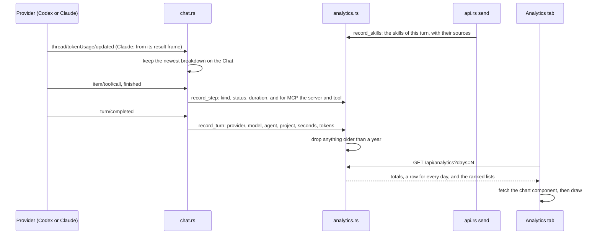

# Analytics: sequence

Back to [Analytics](README.md).

```mermaid
sequenceDiagram
    participant X as Provider (Codex or Claude)
    participant C as chat.rs
    participant A as analytics.rs
    participant S as api.rs send
    participant P as Analytics tab

    S->>A: record_skills: the skills of this turn, with their sources
    X->>C: thread/tokenUsage/updated (Claude: from its result frame)
    C->>C: keep the newest breakdown on the Chat
    X->>C: item/tool/call, finished
    C->>A: record_step: kind, status, duration, and for MCP the server and tool
    X->>C: turn/completed
    C->>A: record_turn: provider, model, agent, project, seconds, tokens
    A->>A: drop anything older than a year
    P->>A: GET /api/analytics?days=N
    A-->>P: totals, a row for every day, and the ranked lists
    P->>P: fetch the chart component, then draw
```
