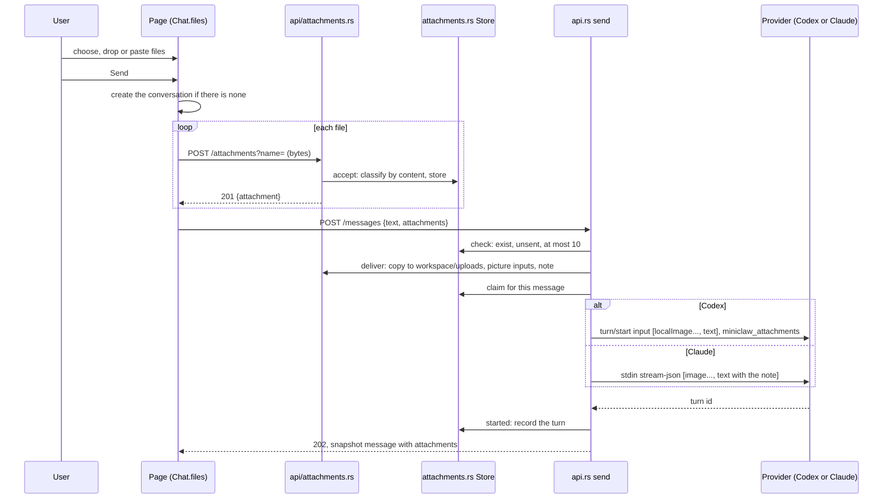

# Files and pictures in messages: sequence

Back to [Files and pictures in messages](README.md).

```mermaid
sequenceDiagram
    participant U as User
    participant P as Page (Chat.files)
    participant A as api/attachments.rs
    participant S as attachments.rs Store
    participant M as api.rs send
    participant X as Provider (Codex or Claude)

    U->>P: choose, drop or paste files
    U->>P: Send
    P->>P: create the conversation if there is none
    loop each file
        P->>A: POST /attachments?name= (bytes)
        A->>S: accept: classify by content, store
        A-->>P: 201 {attachment}
    end
    P->>M: POST /messages {text, attachments}
    M->>S: check: exist, unsent, at most 10
    M->>A: deliver: copy to workspace/uploads, picture inputs, note
    M->>S: claim for this message
    alt Codex
        M->>X: turn/start input [localImage..., text], miniclaw_attachments
    else Claude
        M->>X: stdin stream-json [image..., text with the note]
    end
    X-->>M: turn id
    M->>S: started: record the turn
    M-->>P: 202, snapshot message with attachments
```
