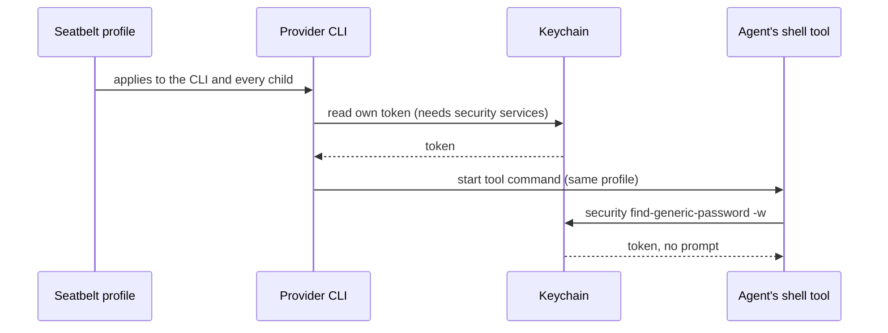
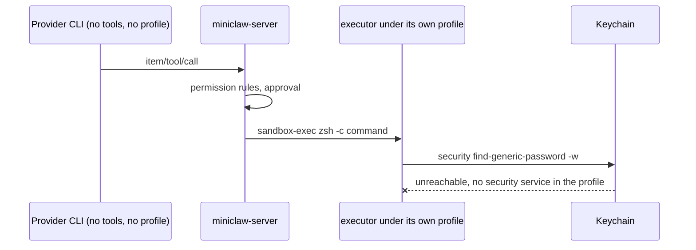

# Native tools probe sequence

Back to the [probe](README.md).

## Why one profile around a provider CLI leaks its sign-in

```mermaid
sequenceDiagram
    participant Profile as Seatbelt profile
    participant CLI as Provider CLI
    participant Keychain
    participant Shell as Agent's shell tool

    Profile->>CLI: applies to the CLI and every child
    CLI->>Keychain: read own token (needs security services)
    Keychain-->>CLI: token
    CLI->>Shell: start tool command (same profile)
    Shell->>Keychain: security find-generic-password -w
    Keychain-->>Shell: token, no prompt
```

## Why MiniClaw's tool does not

```mermaid
sequenceDiagram
    participant CLI as Provider CLI (no tools, no profile)
    participant Backend as miniclaw-server
    participant Exec as executor under its own profile
    participant Keychain

    CLI->>Backend: item/tool/call
    Backend->>Backend: permission rules, approval
    Backend->>Exec: sandbox-exec zsh -c command
    Exec->>Keychain: security find-generic-password -w
    Keychain--xExec: unreachable, no security service in the profile
```
