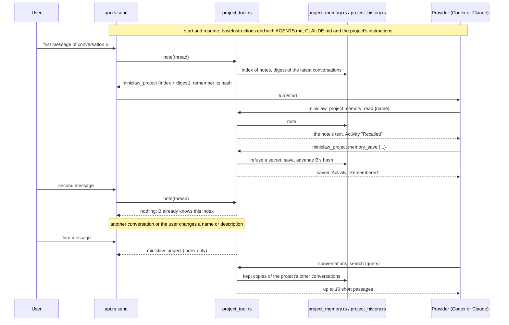

# Projects that remember: sequence

Back to [Projects that remember](README.md).

```mermaid
sequenceDiagram
    participant U as User
    participant S as api.rs send
    participant T as project_tool.rs
    participant M as project_memory.rs / project_history.rs
    participant X as Provider (Codex or Claude)

    Note over S,X: start and resume: baseInstructions end with AGENTS.md, CLAUDE.md and the project's instructions
    U->>S: first message of conversation B
    S->>T: note(thread)
    T->>M: index of notes, digest of the latest conversations
    T-->>S: miniclaw_project (index + digest), remember its hash
    S->>X: turn/start
    X->>T: miniclaw_project memory_read {name}
    T->>M: note
    T-->>X: the note's text, Activity "Recalled"
    X->>T: miniclaw_project memory_save {...}
    T->>M: refuse a secret, save, advance B's hash
    T-->>X: saved, Activity "Remembered"
    U->>S: second message
    S->>T: note(thread)
    T-->>S: nothing: B already knows this index
    Note over S,T: another conversation or the user changes a name or description
    U->>S: third message
    T-->>S: miniclaw_project (index only)
    X->>T: conversations_search {query}
    T->>M: kept copies of the project's other conversations
    T-->>X: up to 10 short passages
```
